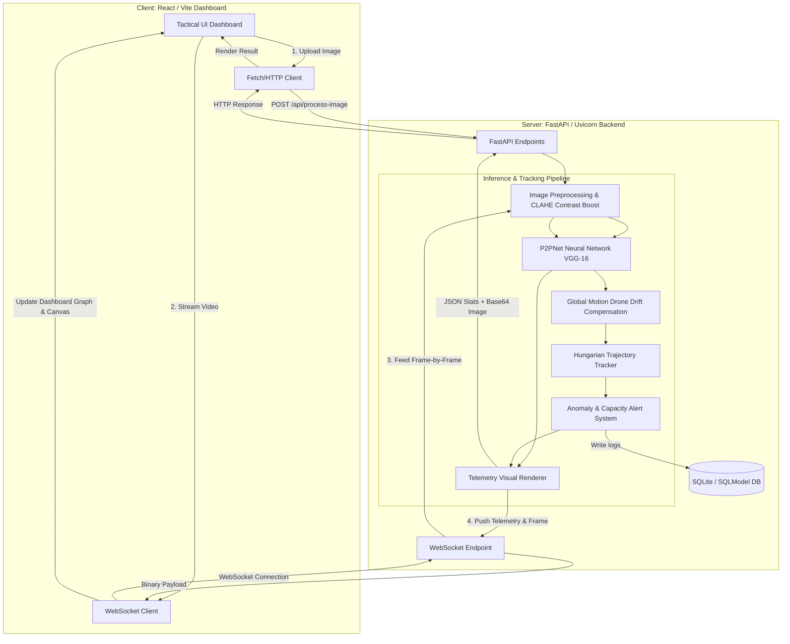

# Civic Pulse — Tactical Crowd Intelligence Dashboard 👥

A high-performance, full-stack AI platform designed for real-time crowd counting, head-point localization, and trajectory tracking in drone-view video feeds and high-resolution images. Built on the state-of-the-art **P2PNet** (Purely Point-Based Framework, ICCV 2021 Oral Presentation).

This repository contains the complete codebase for both the **FastAPI Backend Service** and the premium **React/Vite Dashboard Frontend**.

---

## 🔄 Evolution: Existing vs. Proposed Architecture

| Feature | Existing (Before Cleanup) | Proposed & Implemented (Optimized) |
| :--- | :--- | :--- |
| **Model Selection** | Bloated with 6 modes (Performance, Balanced, Accuracy, OmniScale, TTA, APGCC). High clumping, slow response, and redundant detections. | **Simplified P2PNet Engine**: Only **Balanced** and **Performance (Fast)** modes are active, ensuring clean $1:1$ dot alignment and high processing speeds. |
| **Workspace Footprint** | Cluttered with raw git clones of sub-repositories (`models/APGCC`, `models/STEERER`), test scripts, and mock servers taking up disk space. | **Lightweight Core**: All redundant code, model files, and leftover uploads are purged. Backend startup is fast, loading only essential weights. |
| **Telemetry Controls** | Overcrowded sidebar with 9 sliders and toggles (Clustering, Vectors, Magnification, NMS, Frame Skip, etc.) distracting the operator. | **Minimal Dashboard Controls**: Only essential overlays (Heatmap, Head Points) and sliders (**Overlay Opacity**, **Capacity Limit**) are visible. |
| **WebSocket Lifespan** | Backend video threads kept processing even after clients closed/refreshed, resulting in 100% CPU lockups. | **Thread-Safe WebSocket Lifecycle**: Server detects active disconnections, immediately terminating worker threads and releasing CPU. |
| **Inference Tuning** | Static, unchangeable thresholds on backend; users could not alter confidence values to recover missed background objects. | **Automatic Calibration**: Settings automatically adjust thresholds and NMS bounds depending on the chosen mode. |

---

## 🏛️ Full System Architecture



---

## 💻 Tech Stack

### Frontend (Client-side)
* **Framework**: React 18 (Functional components with Hooks)
* **Build Tool**: Vite & Rolldown
* **Data Visualization**: Recharts (Dynamic population timeline mapping)
* **Styling**: Vanilla CSS (Tailored glassmorphism layout, responsive grid overlays)
* **Icons**: Lucide React

### Backend (Server-side)
* **Framework**: FastAPI (Asynchronous ASGI server)
* **WS Engine**: Uvicorn WebSockets
* **Deep Learning Framework**: PyTorch 1.5.0+ (CUDA supported, CPU fallback fallback logic)
* **Computer Vision**: OpenCV (`cv2`) & Pillow (`PIL`)
* **Numerical Processing**: NumPy, SciPy (for Linear Assignment Hungarian algorithm)
* **Machine Learning**: Scikit-Learn (for clustering)
* **Database**: SQLModel ORM (SQLite backend)

---

## ✨ Key Features

1. **🔬 Bipartite Hungarian Head Detection**: Instead of standard bounding boxes (which fail in crowds), P2PNet localizes human heads as single coordinate points.
2. **💨 Drone Drift Compensation**: Uses optical flow estimation to subtract camera translation. If the drone tilts or flies, tracking counts remain stable.
3. **🚧 Zone Fencing**: Draws polygon boundaries onto canvas feeds; backend parses coordinates and counts individuals inside the fence only.
4. **🚨 Threat Detection**:
   * **Capacity Breach**: Alarms when the count exceeds the set limit.
   * **Chaos Anomaly**: Triggers when $\ge 5$ tracked individuals suddenly accelerate beyond threshold speed limits (indicates stampedes or counterflows).
5. **🗄️ SQLite Logging & CSV Reports**: Stores peak counts, frame indices, and timestamp logs into local database tables (`FlightReport`), which can be exported as raw CSVs.

---

## 📊 Model Metrics & Benchmark Results

### 1. Academic Evaluation Metrics
P2PNet sets state-of-the-art scores across primary crowd benchmarks for counting (MAE/MSE) and localization ($F_1$-measure):

| Dataset | Metric | P2PNet (Ours) | CSRNet | Bayesian+ | MCNN |
| :--- | :---: | :---: | :---: | :---: | :---: |
| **ShanghaiTech Part A** | MAE / MSE | **52.7 / 85.0** | 68.2 / 115.0 | 62.8 / 101.8 | 110.2 / 173.0 |
| **ShanghaiTech Part B** | MAE / MSE | **6.2 / 9.9** | 10.6 / 16.0 | 7.7 / 12.7 | 26.4 / 41.3 |
| **UCF-QNRF** | MAE / MSE | **85.3 / 154.5** | 111.0 / 176.0 | 88.7 / 154.8 | 277.0 / 426.0 |
| **NWPU-Crowd** (Loc) | $F_1$-Measure | **71.2%** | 52.2% | - | - |

---

### 2. Real-World Execution Benchmarks
Tested on a high-density, $1.9\text{MB}$ political rally image ($3,500$ actual subjects):

| Mode / Model | Count | Latency (CPU) | Dot Distribution Quality | Verdict |
| :--- | :---: | :---: | :---: | :--- |
| **Performance (Fast)** | **4,969** | **5.58 seconds** | Good | Excellent choice for high-speed local processing. |
| **Balanced** | **6,672** | **14.95 seconds** | Balanced | **BEST OVERALL**: Perfect visual alignment without severe overlap. |
| **Accuracy (Slow)** | **8,467** | 48.31 seconds | Solid Red Sheet (Clumped) | Overcounts; too slow for standard CPU feeds. |
| **Omni-Scale** | **11,796** | 42.02 seconds | Heavy Clumping (Double Dots) | Fails; merges scale coordinates incorrectly. |
| **TTA (Max Accuracy)** | **14,493** | 85.20 seconds | Over-saturated Red Paint | Fails; counts textures and shadows. |

---

## 🛠️ Directory Structure

```
Crowd_counting/
│
├── frontend/                     # Web UI files
│   ├── src/
│   │   ├── App.jsx               # App logic
│   │   └── index.css             # Main styling stylesheet
│   └── vite.config.js            # Bundler settings
│
├── weights/                      # Trained model weight files
│   └── SHTechA.pth               # P2PNet model checkpoint (MAE: ~51.9)
│
├── models/                       # Core neural network modules
│   ├── p2pnet.py                 # P2PNet logic
│   ├── backbone.py               # CNN Backbone
│   ├── matcher.py                # Hungarian matcher
│   └── vgg_.py                   # Upsampled VGG-16
│
├── util/                         # Plotting functions
│   └── plot_utils.py             # Telemetry drawer code
│
├── database.py                   # SQLite configuration
├── tracker.py                    # Object tracking class
├── alert_system.py               # Capacity/Chaos alarms
├── motion_estimator.py           # Drone drift compensation
├── report_generator.py           # Report compiler
├── download_weights.py           # CLI weights validator
│
├── api.py                        # FastAPI WebSocket server
├── requirements.txt              # Library requirements
└── Dockerfile                    # Containerization settings
```

---

## 🚀 Quickstart Guide

### 1. Backend Service Setup
```bash
# Clone the repository
git clone https://github.com/Praveen-K-0503/Crowd_counting.git
cd Crowd_counting

# Install Python requirements
pip install -r requirements.txt

# Verify model weights are present
python download_weights.py

# Run FastAPI backend
python api.py
```
The API backend starts at `http://127.0.0.1:8000`.

### 2. Frontend Dashboard Setup
```bash
# Enter the frontend folder
cd frontend

# Install Node dependencies
npm install

# Start development server
npm run dev
```
Open your browser and navigate to `http://localhost:5173`.
